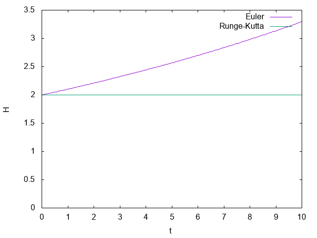
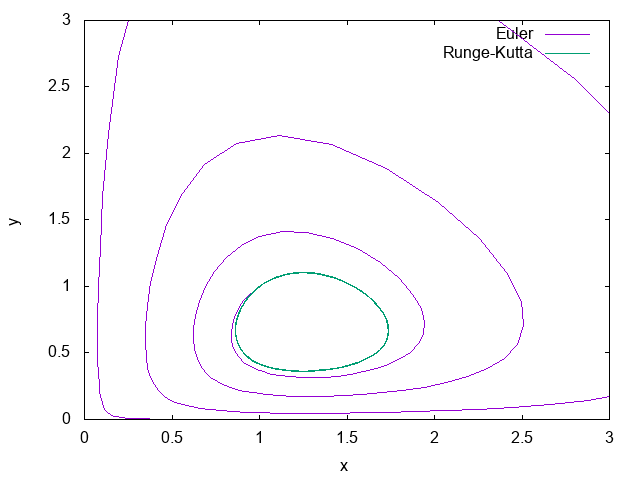
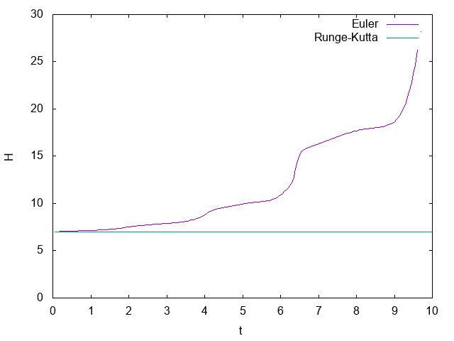

[Japanese](README_ja.md)/ English

# Implementation of the Runge-Kutta method

## Summary

Numerical integration of Lotka-Volterra equations and the harmonic oscillator with the Runge-Kutta method and the Euler method.

## Usage

```
$ make
$ ./a.out
$ gnuplot plot.plt
```

## Results

* Phase space of the harmonic oscillator.


* Time evolution of the conserved value.


* Phase space of the Lotka-Volterra system.


* Time Evolution of the conserved value.

