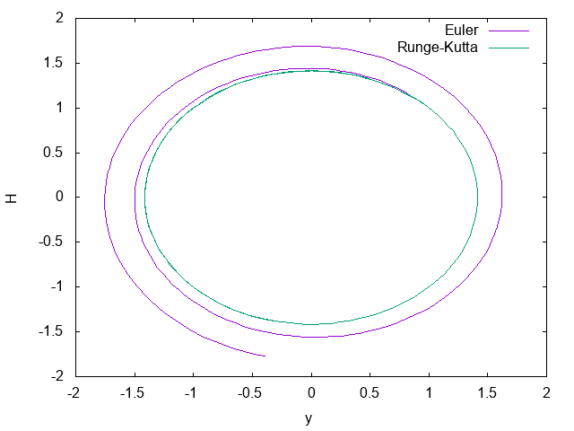
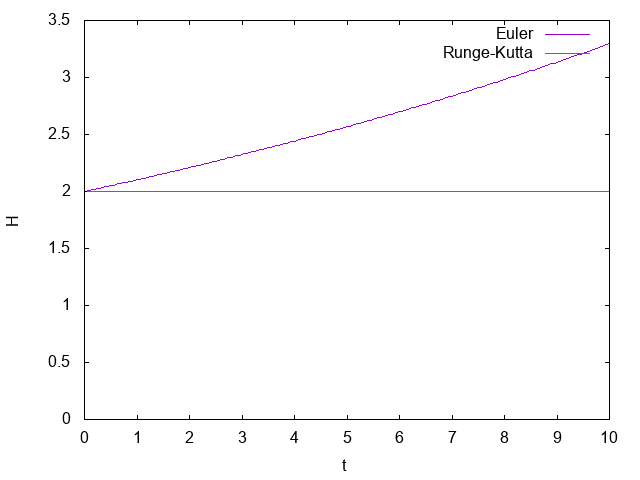
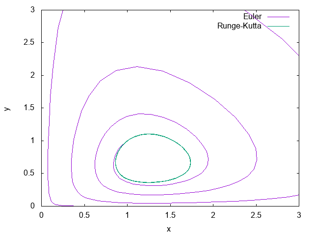
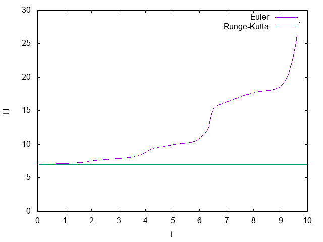

Japanese/ [English](README.md)

# ルンゲ＝クッタ法の実装サンプル

## 概要

4次のルンゲ＝クッタ法を実装し、ロトカ・ヴォルテラ方程式と調和振動子において1次のオイラー法とくらべて見るサンプル。

## 使い方

```
$ make
$ ./a.out
$ gnuplot plot.plt
```

## 結果

* 調和振動子系の位相空間


* 調和振動子系におけるエネルギーの時間発展


* ロトカ・ヴォルテラ系の位相空間


* ロトカ・ヴォルテラ系における保存量の時間発展

